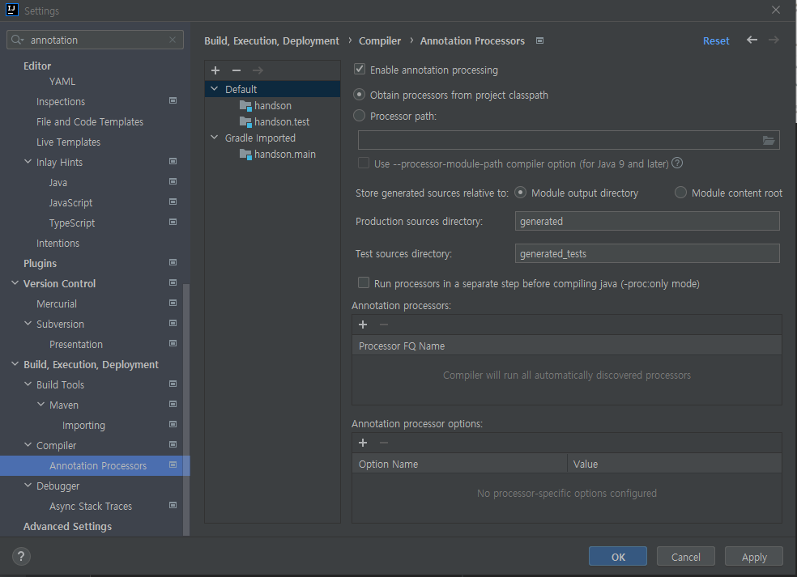

# 프로젝트 세팅 #
프로젝트 주소 : https://github.com/tongnamuu/SpringEvent

Java 11을 사용합니다. 

처음부터 세팅하고 싶다면

이후 annotation processing 옵션을 켜주세요

이후 프로젝트 repository의 커밋을 따라오시면 그대로 실습하실 수 있습니다.

# 우리가 실습해볼 것 #
- 회원 가입 api를 이벤트를 활용해 개선해 봅니다. 
- 회원가입 플로우는 아래와 같습니다.
  - 회원가입을 하면 유저를 저장합니다
  - 알람이 나갑니다
  - 쿠폰을 발급해 줍니다
  - 이메일과 SMS로 환영 메시지를 보냅니다 
